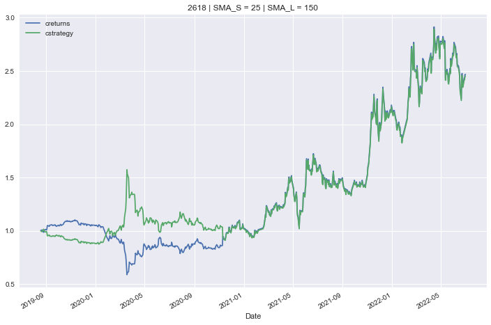
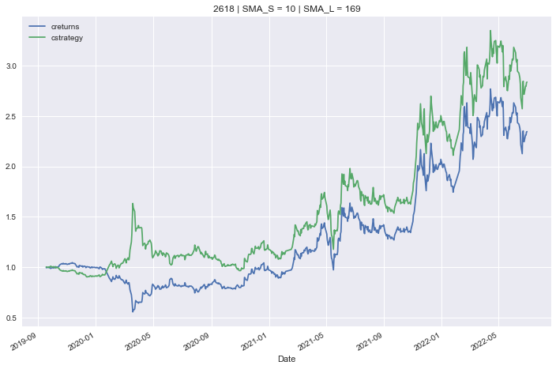

# Optimization of parameters for SMA Strategy

## What is this?
**Class** for the backtesting of SMA strategies

## Project of Contents
- Dataset: Data source from yahoo finance

## Main funtion
   MA_Strategy(ticker_name, MA_Short, MA_Long, start, end)
   
       '''
    "        Input
    "        ----------
    "        ticker_name: str
    "            ticker symbol to be backtested
    "        MA_Short: int
    "            Sliding window in bars (e.g. days) for shorter Simple Moving Average
    "        MA_Long: int
    "            Sliding window in bars (e.g. days) for longer Simple Moving Average
    "        start: str
    "            start date for data import
    "        end: str
    "            end date for data import
    "       -----------
    EX.
    tester=MA_Strategy(2618,50, 200, "2019-01-01", "2022-06-30")
    
   ### Updates SMA parameters and the prepared dataset
    tester.set_parameters(SMA_S = 25, SMA_L = 150)
    
   ### Backtests the SMA-based trading strategy
    tester.test_strategy()
    
   ### Plots the performance of the trading strategy and compares to buy and hold
    tester.plot_results()
   
   
  ### Finds the optimal strategy (global maximum) given the SMA parameter ranges
    
     Parameters
     ----------
     SMA_S_range, SMA_L_range: tuple
         tuples of the form (start, end, step size)
     ----------  
      EX.
      tester.optimize_parameters((10, 20, 1), (150, 200, 1))
      tester.plot_results()
   